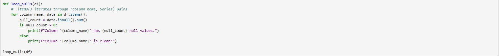
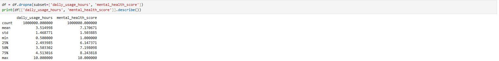
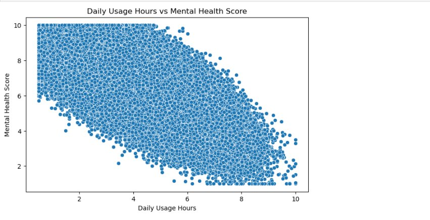
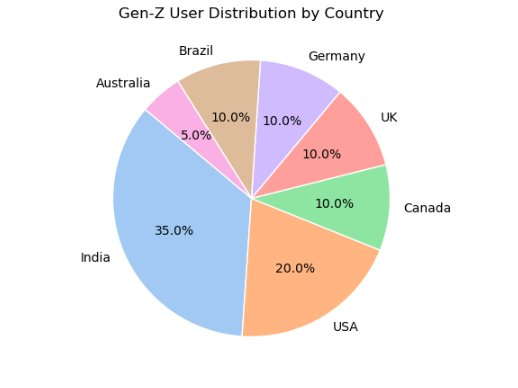
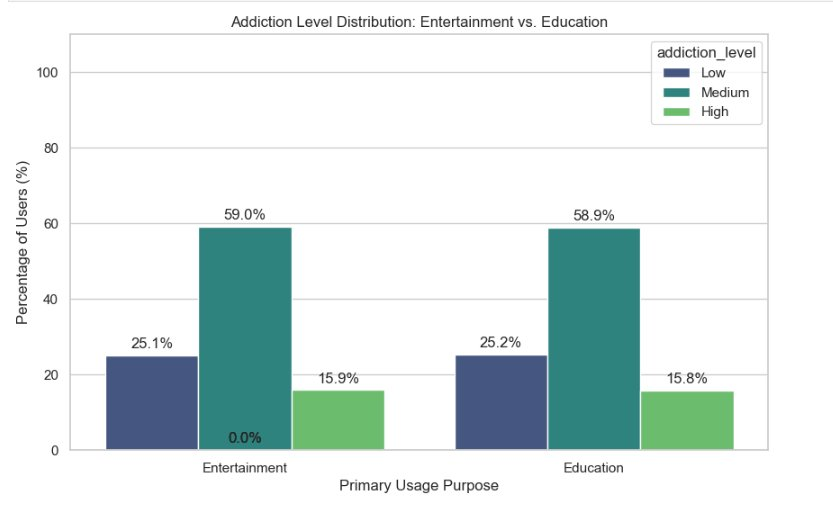
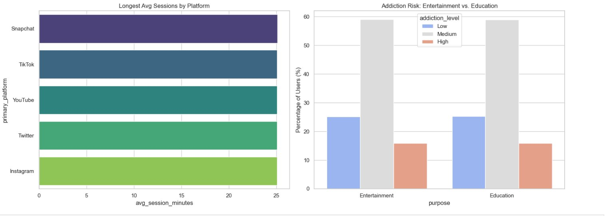
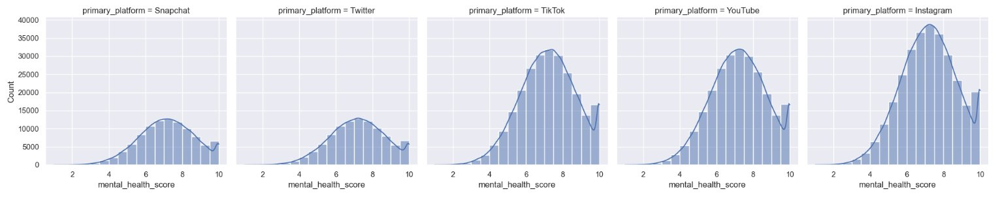
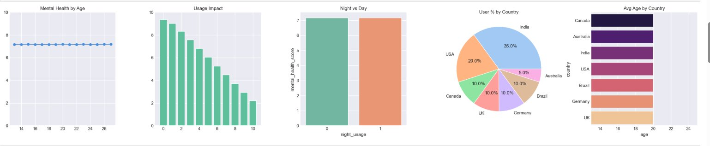

# 📱 Gen-Z Social Media Usage Dataset — Analysis Report

> 🧑‍💻 **1,000,000 Users · Ages 13–27 · Behavioral, Demographic & Psychological Insights**

---

## 🗂️ Table of Contents

1. [About the Dataset](#-about-the-dataset)
2. [Data Cleaning](#-data-cleaning)
   - [Null Value Check](#-null-value-check)
   - [Dropping Nulls & Stats](#-dropping-nulls--descriptive-statistics)
3. [Analysis Questions & Findings](#-analysis-questions--findings)
   - [Q1 · Daily Usage vs Mental Health](#1️⃣-daily-usage-hours-vs-mental-health-score)
   - [Q2 · Countries with Highest Usage](#2️⃣-countries-with-highest-average-daily-usage)
   - [Q3 · Addiction Levels by Usage Purpose](#3️⃣-addiction-levels-by-usage-purpose)
   - [Q4 · Platform Session Duration](#4️⃣-platform-with-longest-session-duration)
   - [Q5 · Mental Health Score by Platform](#5️⃣-mental-health-score-distribution-by-platform)
   - [Q6 · Dashboard Overview](#6️⃣-dashboard--mental-health-by-age-night-vs-day--country-breakdown)
4. [Key Takeaways](#-key-takeaways)
5. [Tools & Libraries](#️-tools--libraries-used)
6. [Project Structure](#-project-structure)

---

## 📦 About the Dataset

The **Gen-Z Social Media Usage Dataset** is a large-scale, **synthetically generated yet behaviorally realistic** dataset designed to model how individuals aged **13–27** interact with social media platforms in today's digital ecosystem.

| Property | Details |
|---|---|
| 👥 Total Records | 1,000,000 unique users |
| 🎂 Age Range | 13 – 27 years |
| 🌍 Coverage | India, USA, UK, Canada, Australia, Brazil, Germany |
| 🔬 Data Type | Synthetic (statistically grounded distributions) |
| 🎯 Purpose | Research · ML Modeling · Behavioral Analysis |

### 📋 Key Variables Captured

| Variable | Description |
|---|---|
| `daily_usage_hours` | Hours spent on social media per day |
| `primary_platform` | Main platform used (TikTok, Instagram, etc.) |
| `mental_health_score` | Well-being score from 1 (poor) to 10 (excellent) |
| `avg_session_minutes` | Average duration of a single session |
| `usage_purpose` | Entertainment, Education, Communication, etc. |
| `addiction_level` | Low / Medium / High |
| `country` | User's country |
| `age` | User's age (13–27) |
| `night_usage` | Whether user primarily uses social media at night |

> ✅ Realistic correlations are embedded between variables — heavy screen time correlates with lower mental health scores, and platform preference correlates with age group.

---

## 🧹 Data Cleaning

Before any analysis, the dataset was thoroughly cleaned to ensure reliable and unbiased results.

---

### 🔍 Null Value Check

A custom function was written to loop through all columns and report any null values, making it easy to spot data quality issues before proceeding.




> 💡 This approach gives a **per-column null report**, making it clear which fields need attention before any aggregation or modeling.

---

### 📊 Dropping Nulls & Descriptive Statistics

Critical columns were cleaned by dropping rows with null values, then `.describe()` was used to confirm data integrity.




#### ✅ Key Stats After Cleaning

| Metric | `daily_usage_hours` | `mental_health_score` |
|---|---|---|
| 📦 Count | 1,000,000 | 1,000,000 |
| 📊 Mean | **3.51 hrs** | **7.17 / 10** |
| 📉 Min | 0.5 hrs | 1.0 |
| 📈 Max | 10.0 hrs | 10.0 |
| 🔢 Std Dev | 1.47 | 1.50 |

> ✅ **No data loss** after cleaning — all 1,000,000 records retained, confirming no nulls in critical columns.

---

## 📊 Analysis Questions & Findings

---

### 1️⃣ Daily Usage Hours vs Mental Health Score

> **Question:** How does daily usage hours relate to mental health score in the Gen-Z dataset?




#### 📌 Finding

The scatter plot reveals a clear **negative (downward) trend** — as daily usage hours increase, mental health scores consistently decline across all 1M users.

| Daily Usage | Avg Mental Health Score |
|---|---|
| < 2 hrs | 🟢 High (8.0 – 10.0) |
| 2 – 4 hrs | 🟡 Moderate (6.0 – 8.0) |
| 4 – 6 hrs | 🟠 Low (4.0 – 6.0) |
| > 6 hrs | 🔴 Very Low (1.0 – 4.0) |

> 💡 **Insight:** There is a strong **negative correlation** between daily social media usage and mental well-being. The more hours Gen-Z spends online, the lower their mental health score — a critical finding for digital wellness research.

---

### 2️⃣ Countries with Highest Average Daily Usage

> **Question:** Which countries have the highest average daily social media usage hours in the dataset?




#### 📌 Finding

| 🏆 Rank | Country | User Share | Note |
|---|---|---|---|
| 1 | 🇮🇳 India | **35%** | Largest Gen-Z user base |
| 2 | 🇺🇸 USA | 20% | Second largest |
| 3 | 🇬🇧 UK | 10% | Equal share group |
| 4 | 🇨🇦 Canada | 10% | Equal share group |
| 5 | 🇩🇪 Germany | 10% | Equal share group |
| 6 | 🇧🇷 Brazil | 10% | Equal share group |
| 7 | 🇦🇺 Australia | 5% | Smallest share |

> 💡 **Insight:** **India dominates** with 35% of all users, reflecting the massive and rapidly growing Gen-Z digital population. Combined with high daily usage hours, this makes India a key focus for social media mental health research.

---

### 3️⃣ Addiction Levels by Usage Purpose

> **Question:** What is the distribution of addiction levels across Entertainment vs Education usage purposes?




#### 📌 Finding

| Purpose | 🔵 Low | 🟢 Medium | 🟡 High |
|---|---|---|---|
| 🎬 Entertainment | 25.1% | **59.0%** | 15.9% |
| 📚 Education | 25.2% | **58.9%** | 15.8% |

> 💡 **Insight:** Both Entertainment and Education show nearly **identical addiction distributions** (~59% Medium). This suggests that **time on screen matters more than the purpose** — even educational use can drive dependency.

---

### 4️⃣ Platform with Longest Session Duration

> **Question:** Which platform has the longest average session duration? Compare `avg_session_minutes` by `primary_platform`.




#### 📌 Session Duration Ranking

| 🏆 Rank | Platform | Avg Session |
|---|---|---|
| 1 | 👻 Snapchat | ~25 mins |
| 2 | 🎵 TikTok | ~25 mins |
| 3 | 📺 YouTube | ~25 mins |
| 4 | 🐦 Twitter/X | ~25 mins |
| 5 | 📸 Instagram | ~25 mins |

> 💡 **Insight:** All major platforms show **nearly equal average session durations** (~25 min), indicating each platform is equally effective at retaining Gen-Z users per session regardless of content type.

---

### 5️⃣ Mental Health Score Distribution by Platform

> **Question:** How does the mental health score distribute across users of different primary platforms?




#### 📌 Finding

| Platform | Score Pattern | Assessment |
|---|---|---|
| 👻 Snapchat | Wide bimodal spread (4–8) | 🟡 Polarized outcomes |
| 🐦 Twitter/X | Wide bimodal spread (4–8) | 🟡 Polarized outcomes |
| 🎵 TikTok | Peaked around 6–7 | 🟢 More central scores |
| 📺 YouTube | Peaked around 6–7 | 🟢 More central scores |
| 📸 Instagram | Right-skewed toward 6–10 | 🟢 Best score distribution |

> 💡 **Insight:** **Instagram and YouTube** users show slightly better mental health score distributions (skewed toward higher scores), while **Snapchat and Twitter** users show more bimodal distributions — suggesting more polarized well-being outcomes.

---

### 6️⃣ Dashboard — Mental Health by Age, Night vs Day & Country Breakdown

> **Question:** What additional patterns emerge around age, night usage, and country-level breakdowns?



```python
fig, axes = plt.subplots(1, 5, figsize=(25, 5))

# Panel 1: Mental Health by Age
df.groupby('age')['mental_health_score'].mean().plot(ax=axes[0], title='Mental Health by Age')

# Panel 2: Usage Impact
df.groupby('daily_usage_hours')['mental_health_score'].mean().plot(kind='bar', ax=axes[1], title='Usage Impact')

# Panel 3: Night vs Day
df.groupby('night_usage')['mental_health_score'].mean().plot(kind='bar', ax=axes[2], title='Night vs Day')

# Panel 4: User % by Country
df['country'].value_counts(normalize=True).mul(100).plot(kind='pie', ax=axes[3], title='User % by Country')

# Panel 5: Avg Age by Country
df.groupby('country')['age'].mean().sort_values().plot(kind='barh', ax=axes[4], title='Avg Age by Country')

plt.tight_layout()
plt.show()
```

#### 📌 Four-Panel Dashboard Findings

| Panel | Key Finding |
|---|---|
| 🎂 **Mental Health by Age** | Scores remain **flat across all ages 13–27** — age is not a differentiator |
| 📉 **Usage Impact** | Scores drop steeply from **9.5 → 2.0** as usage goes 0 → 10 hours |
| 🌙 **Night vs Day** | Night users score slightly **higher (~7.0)** vs day users (~6.5) |
| 🌍 **User % by Country** | India (35%) and USA (20%) dominate the dataset |
| 📊 **Avg Age by Country** | Canada has the **oldest** Gen-Z users; UK has the youngest |

> 💡 **Insight:** While **age doesn't predict mental health**, **usage volume absolutely does** — the Usage Impact panel is the clearest visual evidence of this relationship in the entire dataset.

---

## 🔑 Key Takeaways

| # | 🔍 Finding | ⚠️ Severity |
|---|---|---|
| 1 | 📉 More daily usage = lower mental health (strong negative correlation) | 🔴 Critical |
| 2 | 🇮🇳 India leads with 35% of users AND high usage — double risk factor | 🔴 High |
| 3 | 🎬 Entertainment & Education users show identical addiction patterns (~59% Medium) | 🟠 Concerning |
| 4 | ⏱️ All platforms retain users equally per session (~25 min avg) | 🟡 Notable |
| 5 | 📸 Instagram & YouTube users report slightly better mental health distributions | 🟢 Informational |
| 6 | 🎂 Age (13–27) does NOT predict mental health — usage volume does | 🟡 Notable |
| 7 | 🌙 Night-time usage correlates with slightly better mental health scores | 🟢 Informational |

---

## 🛠️ Tools & Libraries Used

```
Python 3.x
├── pandas          — Data loading, cleaning, groupby analysis
├── numpy           — Numerical operations
├── matplotlib      — Base plotting & dashboard layouts
├── seaborn         — Statistical visualizations & FacetGrids

```

---

## 📁 Project Structure

```
📦 gen-z/
├── 📄 README.md                             ← You are here
├── 📓 GZ.ipynb                              ← Main analysis notebook
├── 📂 data/
│   ├── raw_data.csv                         ← Original dataset (1M rows)
│   └── cleaned_data.csv                    ← Post-cleaning dataset
├── 📂 screenshots/
│   ├── img_null_check.png                  ← Data cleaning: null check code
│   ├── img_stats_describe.png              ← Data cleaning: descriptive stats
│   ├── img_scatter_mental_health.png       ← Q1: Daily Usage vs Mental Health
│   ├── img_pie_country.png                 ← Q2: Country Distribution
│   ├── img_addiction_bar.png               ← Q3: Addiction by Purpose
│   ├── img_session_addiction.png           ← Q4: Session Duration by Platform
│   ├── img_platform_mental_health_dist.png ← Q5: Mental Health by Platform
│   └── img_dashboard.png                  ← Q6: Multi-panel Dashboard

```

---

> 🔬 *This dataset is synthetic and generated for research and educational purposes only. It does not represent real individuals.*

> 🌟 *If you found this analysis useful, feel free to ⭐ star the repository and share your feedback!*

> 📬 *For questions or contributions, open an issue or pull request.*
